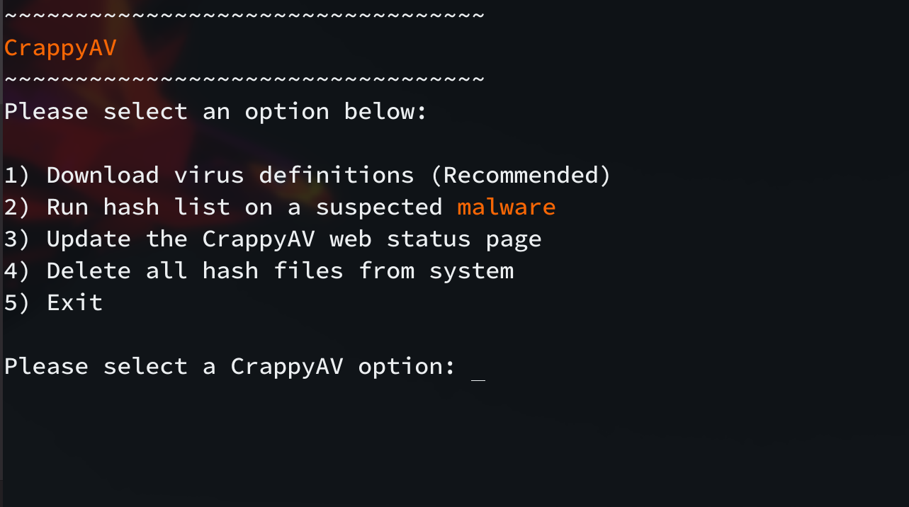
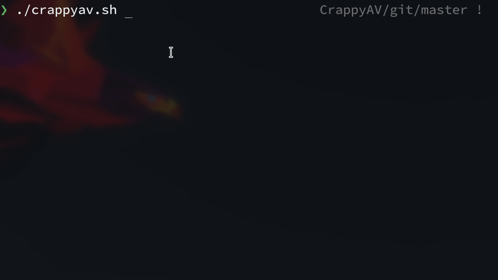
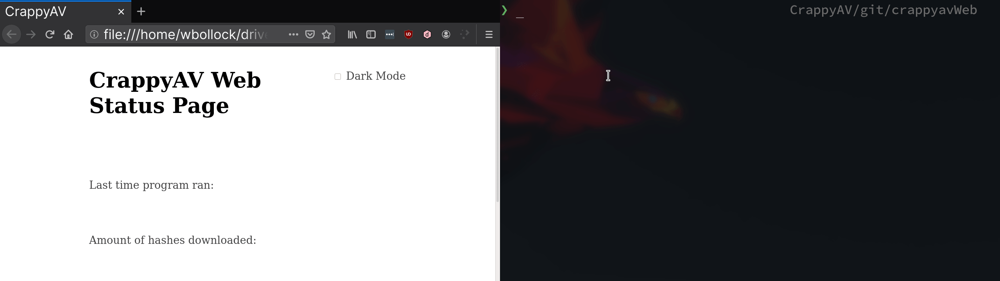

# CrappyAV

A terrible CLI AV. Grabs MD5 hashes of virus files and lets the user scan individual files to see if they match against known virus hashes.

**Nota Bene**:
*Please* do not use this in a production environment or if you are actually worried about malicious files. It is a student project.


## Option Menu



## Quarantine Malware

Take your suspected malware and shove it in a place where the sun doesn't shine. CrappyAV will strip all permissions and put the file in virtual timeout.



## Web Status (Optional)

Show off to the world just how secure you are! 



## Usage

Run the script with:

```
./crappyav.sh
```

Please select "1" before trying to check if a file is malicious. You need to download 1.1GB of virus definitions first.


If you're using ZSH, you'll need to mapfile module.

```
zmodload zsh/mapfile
```

You'll also need `wget`.


### Testing

To test this program, please utilize the convenient testvirus.txt. It's hash has been added to the hashlist, once downloaded. Select option **2** and type "testvirus.txt".

Note to get this file back after quarantine, run:
```
sudo mv jail/testvirus.txt .
sudo chmod 444 testvirus.txt
```

## Credits

Gifs made with [peek](https://github.com/phw/peek)

MD5 Hashes from [VirusShare](https://virusshare.com/hashes.4n6)

John Marks for allowing an open-ended final project!
